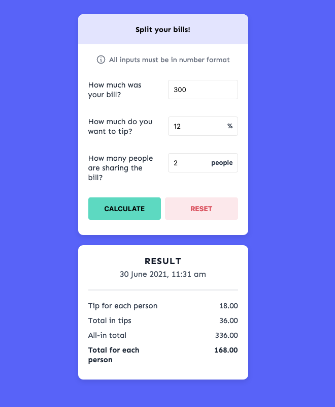

# Table of Contents

- [Table of Contents](#table-of-contents)
  - [Introduction](#introduction)
  - [Screenshots/Gifs](#screenshotsgifs)
  - [Technologies](#technologies)

## Introduction

A web app for calculating how much each patron should pay, including tips, for a given bill. This project was done with HTML, CSS and JavaScript. The user would have to enter the bill amount, a tip amount in percentage, and how many people sharing the bill. Using DOM manipulation, the result card will be shown underneath the inputs card, displaying:

- Tip for each person
- Total in tips
- All-in total, and
- Total for each person

## Screenshots/Gifs

## Technologies

- HTML
- CSS
- JavaScript

